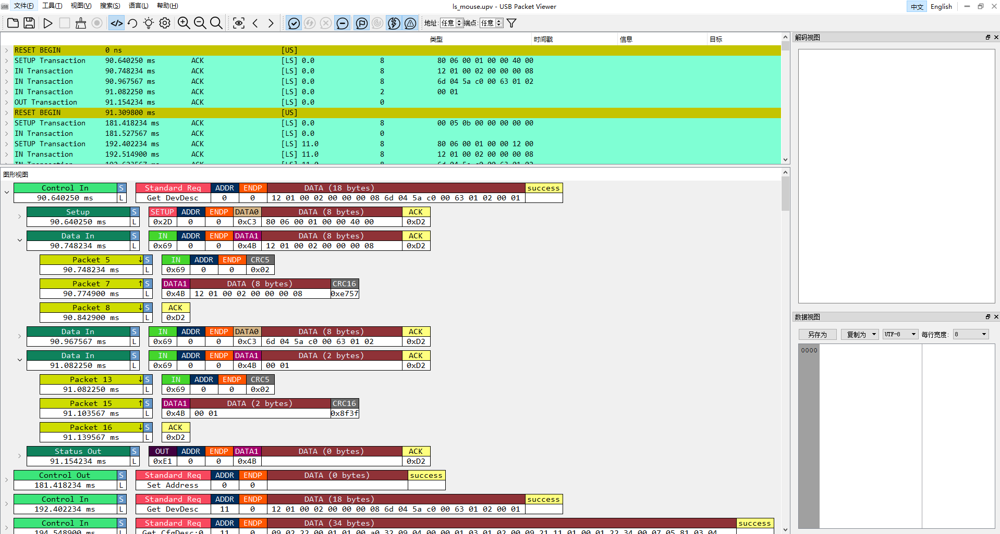

## [USB Packet Viewer](http://www.usbpacketviewer.com/products/)

USB Packet Viewer是一款便携式USB协议分析仪，能够捕捉USB通讯的底层数据包以及总线事件。

## 🐱‍🐉功能特性

- 支持低速、全速和高速
- 通讯速率自动检测
- 32MB硬件缓存深度
- 支持实时协议解析，支持硬件包过滤
- 支持多种协议解析，目前支持HID、MSC、Audio、Video、HUB、CDC、FTDI设备
-  协议解析功能开源，解码功能支持二次开发([查看代码](http://pv-parser.tusb.org/))
- 支持多种文件格式，文件解析支持二次开发([查看代码](http://pv-parser.tusb.org/))

## 🎉效果展示

